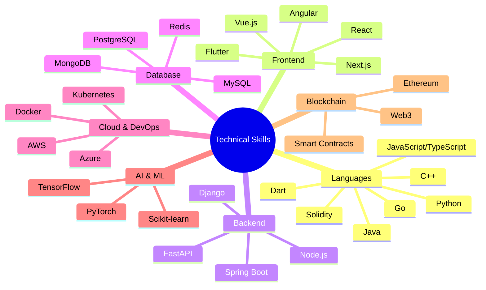
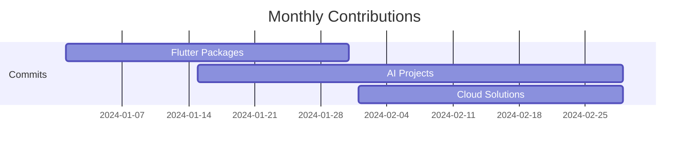
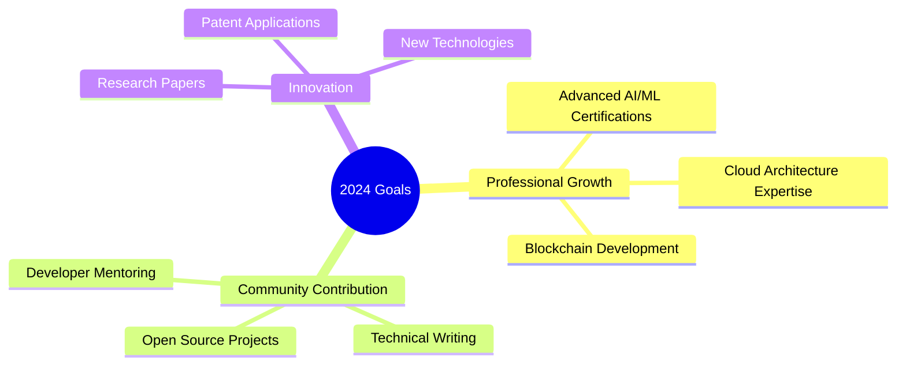

# [](https://git.io/typing-svg)

<div align="center">
  
[](https://git.io/typing-svg)

<p align="center">

</p>

</div>

## 🚀 About Me


I'm a versatile Full-Stack Developer specializing in cutting-edge technologies. My expertise spans across web development, AI/ML, blockchain, and cloud architecture.

```typescript
const samuel = {
    pronouns: "he" | "him",
    code: ["TypeScript", "Python", "Java", "Go", "Solidity", "C++"],
    technologies: {
        frontEnd: {
            js: ["React", "Next.js", "Vue"],
            css: ["Tailwind", "Bootstrap", "Material UI"]
        },
        backEnd: {
            python: ["Django", "FastAPI", "Flask"],
            js: ["Node", "Express"],
            java: ["Spring Boot"]
        },
        mobile: ["Flutter", "React Native"],
        databases: ["MongoDB", "PostgreSQL", "MySQL", "Redis"],
        ai_ml: ["TensorFlow", "PyTorch", "Scikit-learn"],
        blockchain: ["Ethereum", "Solidity", "Web3.js"],
        cloud: ["AWS", "Azure", "GCP"],
        devOps: ["Docker", "Kubernetes", "Jenkins", "GitHub Actions"]
    },
    currentFocus: "Building scalable AI solutions and Web3 applications"
};
```

## 💻 Tech Stack

<div align="center">

### Core Languages


### Frontend Development


### Backend Development


### Mobile App Development


### AI/ML & Data Science


### Database & Cache


### Cloud & DevOps


### Blockchain


</div>

## 📊 GitHub Analytics

<div align="center">


<p align="center">

</p>

### Contribution Statistics


</div>

## 📱 Featured Flutter Packages

<div align="center">

<table>
  <tr>
    <td align="center">
      <a href="https://pub.dev/packages/cs50sdkupdate">
        
        <h3>cs50sdkupdate</h3>
      </a>
      <p>Comprehensive CS POS ES integration solution</p>
      <p>
        
        
        
      </p>
    </td>
    <td align="center">
      <a href="https://pub.dev/packages/flutter_feature_tour">
        
        <h3>flutter_feature_tour</h3>
      </a>
      <p>Customizable feature tour for Flutter apps</p>
      <p>
        
        
        
      </p>
    </td>
  </tr>
  <tr>
    <td align="center">
      <a href="https://pub.dev/packages/structify">
        
        <h3>structify</h3>
      </a>
      <p>Powerful C-style structs for Dart</p>
      <p>
        
        
        
      </p>
    </td>
    <td align="center">
      <a href="https://pub.dev/packages/widget_hydrator">
        
        <h3>widget_hydrator</h3>
      </a>
      <p>StatefulWidget state persistence mixin</p>
      <p>
        
        
        
      </p>
    </td>
  </tr>
</table>

</div>

## 🌟 Skills & Expertise



## 📈 Coding Activity

<div align="center">

[Previous content remains the same until Weekly Development Breakdown]

## 📊 Weekly Development Breakdown

<!--START_SECTION:waka-->
```text
Python       12 hrs 30 mins  ███████████░░░░░░░░  45.83%
JavaScript   8 hrs 15 mins   ██████░░░░░░░░░░░░░  30.28%
Dart         4 hrs 20 mins   ███░░░░░░░░░░░░░░░░  15.89%
Go           2 hrs 45 mins   ██░░░░░░░░░░░░░░░░░  10.00%
Other        2 hrs 10 mins   ██░░░░░░░░░░░░░░░░░   8.00%
```
<!--END_SECTION:waka-->

## 📈 Coding Metrics

<div align="center">

### 🔥 Streak Stats
[](https://git.io/streak-stats)

### ⚡ Recent Activity
<!--START_ACTIVITY-->
- 🚀 Published new version of `widget_hydrator` package
- 💡 Contributed to Flutter community projects
- 🔨 Working on AI-driven solutions
- 📱 Developing new mobile applications
- 🎯 Optimizing cloud infrastructure
<!--END_ACTIVITY-->

### 📊 Monthly Contribution Stats


</div>

## 🛠️ Projects & Collaborations

<div align="center">

### Featured Projects
<!-- PROJECT-LIST:START -->
| Project | Description | Stack | Status |
|---------|-------------|-------|--------|
| 🌟 HaloDish | Food Discovery Platform | Flutter, Django | ✅ Live |
| 💰 OurPesa | Blockchain Finance | Solidity, React | ✅ Live |
| 🔄 Structify | Memory Management | Dart, C++ | 📦 Package |
| 🎯 CS50 SDK | POS Integration | Flutter | 📦 Package |
<!-- PROJECT-LIST:END -->

### Recent Collaborations
- 🤝 Contributing to open-source Flutter projects
- 🔧 Developing AI models for production use
- 📚 Writing technical documentation and guides
- 🎓 Mentoring junior developers

</div>

## 🎯 Goals & Vision



## 🌐 Digital Presence

<div align="center">

### Find me around the web 🌎
- 💼 Sharing updates on <a href="https://www.linkedin.com/in/samuel-ssekizinvu-19a6a3120">LinkedIn</a>
- 🐦 Tweeting about tech on <a href="https://twitter.com/samuelkchris">Twitter</a>
- 📹 Tutorials on <a href="https://youtube.com/@samuelkchris">YouTube</a>
- 📝 Writing articles on <a href="https://dev.to/samuelkchris">Dev.to</a>

### Let's Connect! 🤝
Feel free to reach out for collaborations or just a friendly chat!
- 📫 Email: samuelkchris@gmail.com
- 🌐 Website: [ssekizinvu.me](https://ssekizinvu.me)
- 📅 Schedule a meeting: [Calendly](https://calendly.com/samuelkchris)

</div>

## 🐍 Contribution Graph

<div align="center">


### GitHub Stats Visualization


</div>

---

<div align="center">
  
  
  <h3>💫 "Code is poetry written in logic" 💫</h3>
  
  ### Thanks for visiting! 👋
</div>

<p align="center">

</p>
