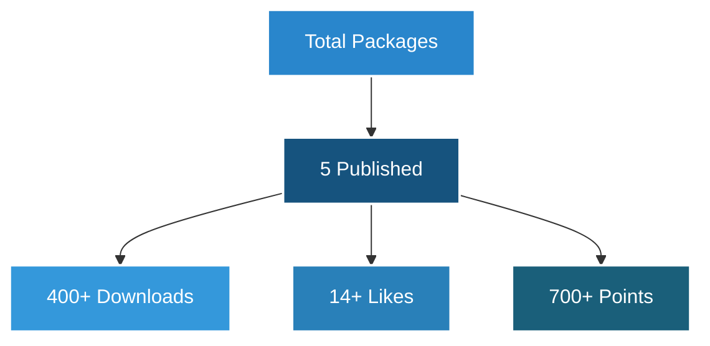

# [](https://git.io/typing-svg)

<div align="center">
  
[](https://git.io/typing-svg)

</div>

## 🚀 About Me


I'm a versatile Full-Stack Developer with expertise in AI/ML and Blockchain technologies. My passion lies in creating innovative solutions that make a difference.

- 🔭 Currently working on **Fintech & AI Solutions**
- 🌱 Learning **Advanced AI/ML** & **Web3**
- 💬 Ask me about **Flutter, Python, Blockchain**
- ⚡ Fun fact: I love solving complex algorithmic problems

## 🛠️ Tech Arsenal

<div align="center">

### Languages & Frameworks


### Frameworks & Libraries


### Cloud & DevOps


</div>

## 📊 GitHub Analytics

<div align="center">
  
</div>

<div align="center">
  
  
</div>

<div align="center">
  
</div>

## 🎯 Featured Flutter Packages

<div align="center">

<table>
  <tr>
    <td align="center">
      <a href="https://pub.dev/packages/cs50sdkupdate">
        
        <h3>cs50sdkupdate</h3>
      </a>
      <p>Comprehensive CS POS ES integration solution</p>
      <p>
        
        
        
      </p>
    </td>
    <td align="center">
      <a href="https://pub.dev/packages/flutter_feature_tour">
        
        <h3>flutter_feature_tour</h3>
      </a>
      <p>Customizable feature tour for Flutter apps</p>
      <p>
        
        
        
      </p>
    </td>
  </tr>
  <tr>
    <td align="center">
      <a href="https://pub.dev/packages/structify">
        
        <h3>structify</h3>
      </a>
      <p>Powerful C-style structs for Dart</p>
      <p>
        
        
        
      </p>
    </td>
    <td align="center">
      <a href="https://pub.dev/packages/widget_hydrator">
        
        <h3>widget_hydrator</h3>
      </a>
      <p>StatefulWidget state persistence mixin</p>
      <p>
        
        
        
      </p>
    </td>
  </tr>
</table>

### 📦 Package Statistics


</div>

## 🌟 Achievements
- 🏆 Contributed to projects serving 50,000+ daily users
- 🎓 Computer Science Graduate from Makerere University
- 💡 Built AI solutions increasing user engagement by 25%
- 🚀 Developed blockchain solutions for financial inclusion

## 📈 Activity Graph
[](https://github.com/samuelkchris/github-readme-activity-graph)

## 🤝 Connect with Me
<div align="center">
  
[](https://www.linkedin.com/in/samuel-ssekizinvu-19a6a3120)
[](https://twitter.com/samuelkchris)
[](https://discord.com/users/samuelkchris)
[](http://www.instagram.com/samuel_k_chris)

</div>

## 📊 Weekly Development Breakdown

<!--START_SECTION:waka-->
```text
Python       12 hrs 30 mins  ███████████░░░░░░░░  45.83%
JavaScript   8 hrs 15 mins   ██████░░░░░░░░░░░░░  30.28%
Dart         4 hrs 20 mins   ███░░░░░░░░░░░░░░░░  15.89%
Other        2 hrs 10 mins   ██░░░░░░░░░░░░░░░░░   8.00%
```
<!--END_SECTION:waka-->

<div align="center">

### 🐍 Watch my contribution graph get eaten by the snake


</div>

---

<div align="center">
  
  
  <h4>Happy Coding! 👨‍💻</h4>
</div>
